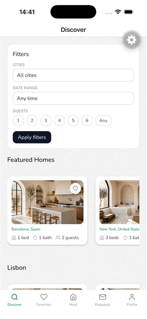
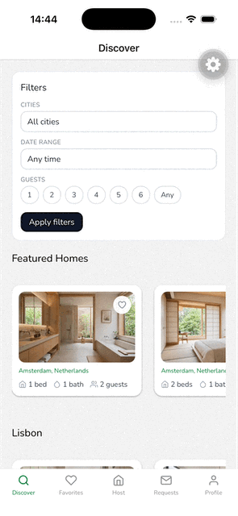
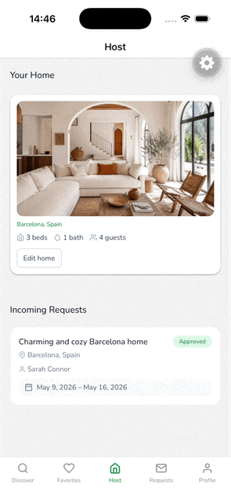

# Familiar — Home Swapping, Reimagined

Browse homes in cities you want to visit, request a stay, and list your own place in return. Familiar is a full-stack home-swapping demo built as an Nx monorepo with a Next.js web app and an Expo mobile app sharing a common DB layer, type system, and design tokens.

**[Live Web Demo →](https://familiar-web-seven.vercel.app/)**

## Features

- **Discover & filter** — Browse homes by city or by using filters
- **Home detail pages** — Photo gallery, availability calendar, amenity list
- **Stay requests** — Guests send requests; hosts approve or reject them
- **Favorites** — Save and manage a personal shortlist
- **Host dashboard** — Edit your own listing (description, amenities, photos)
- **Authentication** — Clerk-powered sign-in on both web and mobile, with webhook-synced user records
- **Photo uploads** — Home photos stored on Vercel Blob
- **Shared design system** — OKLCH color tokens compiled to CSS variables (web) and hex (mobile) from a single source of truth

## Mobile App Demo

|             Discover and filter homes             |                  Handle Favorites                   |          Edit your home details           |
| :-----------------------------------------------: | :-------------------------------------------------: | :---------------------------------------: |
|  |  |  |

## Project Structure

- `apps/web` — Next.js web app (marketing + dashboard + API routes)
- `apps/mobile` — Expo + React Native mobile app ([README](apps/mobile/README.md))
- `apps/web/specs` — Jest unit/integration tests for app logic and components
- `apps/web-e2e` — Playwright e2e tests
- `packages/db` — Drizzle ORM schema, queries, and migrations ([README](packages/db/README.md))
- `packages/types` — Shared TypeScript types used across web and mobile ([README](packages/types/README.md))
- `packages/theme` — Shared color tokens for web and mobile ([README](packages/theme/README.md))

### API Routes (`apps/web/src/app/api`)

| Route                    | Method             | Description                          |
| ------------------------ | ------------------ | ------------------------------------ |
| `/api/cities`            | GET                | List of popular destination cities   |
| `/api/homes`             | GET                | Browse/filter homes                  |
| `/api/homes/[id]`        | GET                | Home detail with availability        |
| `/api/featured-homes`    | GET                | Featured home listings               |
| `/api/my-favorites`      | GET                | Authenticated user's favorited homes |
| `/api/toggle-favorite`   | POST               | Favorite or unfavorite a home        |
| `/api/my-requests`       | GET / POST         | User's outgoing stay requests        |
| `/api/my-requests/[id]`  | DELETE             | Cancel a stay request                |
| `/api/my-homes`          | GET / POST / PATCH | Host's own homes                     |
| `/api/my-homes/[id]`     | PATCH              | Update a specific owned home         |
| `/api/my-homes/requests` | GET                | Incoming requests for a host's homes |
| `/api/webhooks/clerk`    | POST               | Clerk user lifecycle webhook         |

## Tech Stack

- **Nx** — monorepo tooling
- **Next.js 16** (`@org/web`) — web app with App Router
- **Expo 55 + React Native 0.83** (`@org/mobile`) — cross-platform mobile app
- **Tailwind v4** (web) / **NativeWind v4** (mobile) — utility-class styling
- **shadcn/ui** — web component library
- **Drizzle ORM + Neon** — database layer (`@org/db`)
- **Clerk** — authentication (web + mobile)
- **Vercel** — hosting for the web app and Blob storage for home photos
- **Prettier**, **ESLint** — formatting and linting
- **Commitlint + Husky** — [Conventional Commits](https://www.conventionalcommits.org/)
- **Playwright** (`@org/web-e2e`) — e2e tests

## Commands

```sh
# Quick start (from repo root)
pnpm install                       # Install dependencies
pnpm run web                       # Start Next.js dev server (needed for mobile API routes also)
pnpm run mobile                    # Start Expo dev server (auto-syncs local IP to .env.local - needed for API access)

# Web
pnpm nx run @org/web:dev           # Start Next.js dev server
pnpm nx run @org/web:build         # Build web app
pnpm nx run @org/web:lint          # Lint web app
pnpm nx run @org/web-e2e:e2e       # Run Playwright e2e tests

# Mobile
pnpm nx run @org/mobile:start      # Start Expo dev server
pnpm nx run @org/mobile:lint       # Lint mobile app

# All projects
pnpm run test                      # Run all Jest tests
pnpm run lint                      # Lint all projects
pnpm run format                    # Format with Prettier
```

## Database (Drizzle + Neon)

The web app uses Drizzle ORM with Neon PostgreSQL.

Location:

- `packages/db/src/schema.ts` - table definitions
- `packages/db/src/queries` - DB queries
- `packages/db/src/scripts/seed.ts` - seed data for DB
- `packages/db/drizzle` - migration files

Run DB commands from the repo root (delegates to `@org/db`):

```sh
pnpm run db:generate              # Generate migration files from schema
pnpm run db:migrate               # Apply migrations
pnpm run db:push                  # Push schema changes without migration files
pnpm run db:pull                  # Pull remote schema
pnpm run db:seed                  # Seed popular destination cities
pnpm run db:seed:photos           # Seed home photo data
pnpm run db:backfill:clerk-users  # Backfill Clerk user records
pnpm run db:studio                # Open Drizzle Studio
```

### Schema Tables

| Table                | Description                                                           |
| -------------------- | --------------------------------------------------------------------- |
| `clerk_users`        | Synced from Clerk webhooks                                            |
| `cities`             | Popular destination cities                                            |
| `homes`              | Listed homes with amenities, photos, owner                            |
| `home_availability`  | Available date ranges per home                                        |
| `home_stay_requests` | Requests between guests and hosts (`pending \| approved \| rejected`) |
| `home_favorites`     | Per-user favorited homes                                              |

Required environment variables in `packages/db/.env.local`:

```env
DATABASE_URL=your_neon_connection_string
CLERK_SECRET_KEY=your_clerk_secret_key
```

### Vercel Monorepo Notes

- Run `vercel link` to link the repo to Vercel.

To avoid workspace dependency resolution issues for `@org/db` on Vercel:

- Keep installs workspace-aware from the repository root (`pnpm install`).
- Build using Nx from the root (for example: `pnpm nx run @org/web:build`).
- Keep `apps/web/next.config.js` configured for monorepo package transpilation (`transpilePackages` with `@org/db`) and external workspace directories (`experimental.externalDir`).

## Web App Environment Variables

- Run `vercel link` to link the repo to Vercel.
- Run `vercel env pull .env.local` to update local env variables based on values stroed in Vercel
  In `apps/web/.env.local`:

```env
# Clerk Authentication — https://clerk.com
NEXT_PUBLIC_CLERK_PUBLISHABLE_KEY=pk_test_...
CLERK_SECRET_KEY=sk_test_...
NEXT_PUBLIC_CLERK_SIGN_IN_URL=/sign-in
NEXT_PUBLIC_CLERK_SIGN_UP_URL=/sign-up

# Vercel Blob Storage (home photos)
BLOB_READ_WRITE_TOKEN=vercel_blob_rw_...

# Hero image URL (optional)
NEXT_PUBLIC_HERO_IMAGE_URL=https://...
```

## Clerk Webhook Sync

Clerk user lifecycle events are synced to the database at:

- `apps/web/src/app/api/webhooks/clerk/route.ts`

Supported events:

- `user.created` - upsert into `clerk_users`
- `user.updated` - update `clerk_users.updated_at`
- `user.deleted` - delete from `clerk_users`

Configure this endpoint in Clerk Webhooks and use the same signing secret in all runtime environments.

## Frontend

The homepage (`apps/web/src/app/page.tsx`) renders three sections:

- **Hero** — headline and CTA
- **Popular Destinations** — DB-backed city cards loaded via React Suspense with an animated skeleton fallback, and using a delay for demo purposes
- **How It Works** — feature overview

### Popular Destinations

- The section streams in using React Suspense — `PopularDestinationsSkeleton` shows while data loads

## Potential next steps

- Storybook for shared components
- Admin role with dashboards
- Proper 'Sign in with Google' flow
- More e2e tests with Maestro
